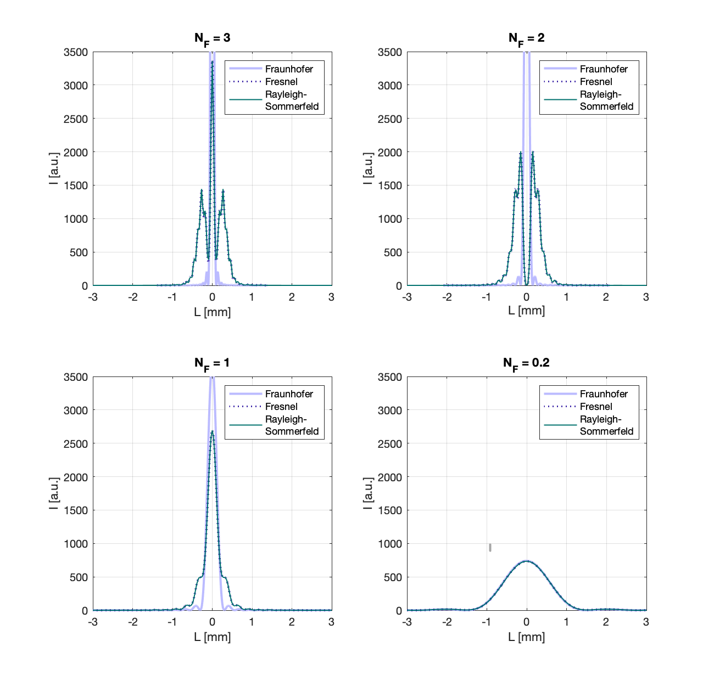
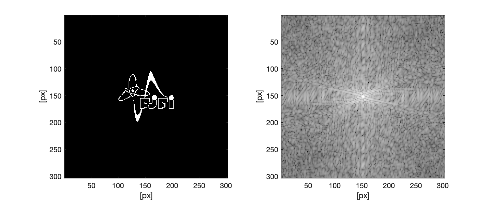
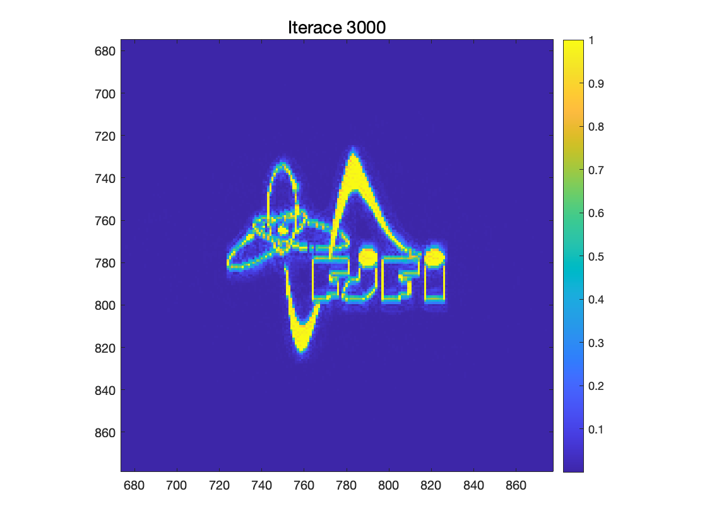

# Lensless imaging
This is a repository accompanying a research project on Lensless imaging methods. The project was assigned as a part of a master's study programme in Numerical Physics at FNSPE CTU. 

## Main practical goals of the project:
- _simulate numerical solutions to the diffraction problem and the paraxial approximations_
- _evaluate the deviation of paraxial approximations for changing Fresnel number_
- _implement Hybrid Input-Output reconstruction algoritm for CDI imaging_
- _add shrinkwrap support updates_
- _introduce noise and a specific dynamic range to the diffraction pattern_

## Implementation
#### Wave propagation
__functions/propagationRS_revised.m__: _a function computing the Rayleigh-Sommerfeld diffraction pattern_  
__functions/propagationFR_revised.m__: _a function computing the Fresnel diffraction pattern_  
__functions/propagationFF.m__: _a function computing the Fraunhofer diffraction pattern_  
__propagation_testing/compare_diff_patterns.m__: _a script performing a comparison (MSE) of FR and RS + FF and RS patterns for given Fresnel number. It has been used mainly for parameter fine-tuning as with inoptimal parameter combination an oscillating numerical artifacts appear on the diffraction pattern profile._  

#### Phase retrieval algorithms  
__retrieval_algorithms/hio_shrinkwrap.m__: _an implementation of Hybrid Input_Output algorithm with shrinkwrap support updates._  
__retrieval_algorithms/hio_shrinkwrap_noise.m__: _reconstructing objects from a diffraction pattern with additive Gaussian noise._  
__noise_dyn_range.m__: _a HIO + shrinkwrap reconstruction from a diffraction pattern considering noise and dynamic range of used camera_  

## Results 
_1D diffraction pattern simulation:_  

_HIO-shrinkwrap reconstruction of a binary object (assuming complex nature):_  
  |  
:-----------------------:|:-----------------------:|
 _Binary image and corresponding diffraction pattern intensity_         | _Reconstruction after 3000 iterations_        
